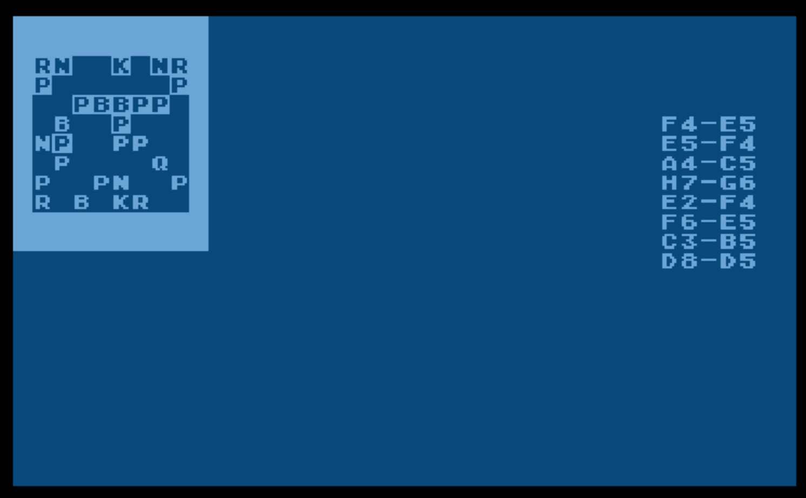

# edfries-chess
Chess program by Ed Fries for Atari 8-bit computers

Unreleased chess program for Atari 8-bit computers, by Ed Fries. Coded in 6502 assembly language with the Mac/65 assembler. 

The XFD file is the canonical source, in an Atari disk image format, from Ed. The .src files were exported by me (Kay Savetz) for easier reading on modern computers.

Ed has released this code under the MIT License. 

The original code only works on 400/800 machines due to calls to EOUTCH at $F6A4. lybrown [ported the chess code to XASM and patched calls to OSB EOUTCH to get it working on XL/XE machines](https://github.com/lybrown/edfries-chess-xasm)

